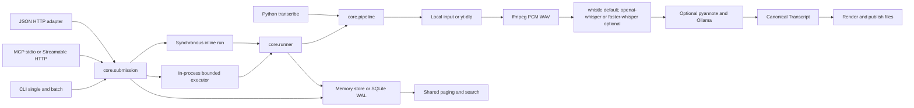
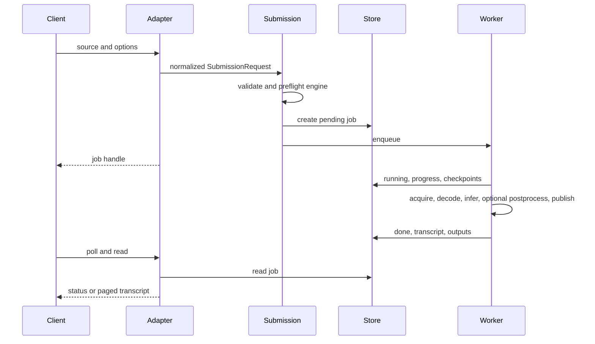
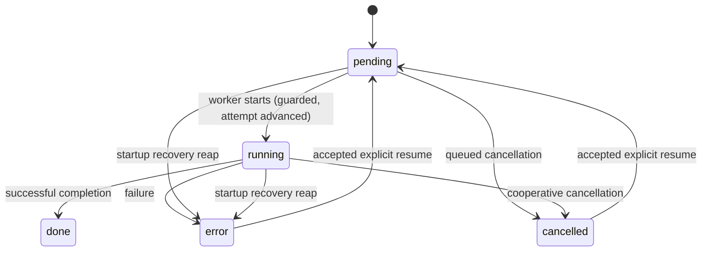

# Architecture and job lifecycle

This guide describes how textflowkit is put together and how a job moves through
it. It is orientation for maintainers and integrators; it is not a deployment
certification or a record of a live run. Everything below is grounded in the
current source paths noted throughout.

## One core, several doors

TextFlowKit is a self-hosted media transcription library with a CLI and two
adapters (MCP and a JSON HTTP API). Native Windows is the primary local target,
including AMD ROCm through PyTorch for the explicit `whisper` engine; no WSL layer
is involved. Linux and macOS are additional targets. The published website is
static documentation and never runs the pipeline.

As of v0.1.9 the default engine is **Whistle**, a CPU-only native CLI that needs
no torch and downloads one pinned model on first use. `openai-whisper` is an
explicit opt-in engine (`--engine whisper`), not the default.

One shared submission contract (`core/submission.py`) owns job creation and
resume for every door. The CLI runs the pipeline synchronously; MCP and HTTP
enqueue work and return a job handle. The public Python `transcribe()` calls the
pipeline directly and creates no adapter job. There is no external message
broker and no distributed worker service.

## Components

| Component | Source | Responsibility |
|---|---|---|
| Submission | `core/submission.py` | Normalize requests, validate engine name and formats/options, check optional-engine availability, match resume, choose inline vs background work |
| CLI batch | `core/batch.py` | Sequential per-source report; later items still run after one fails |
| Executor | `core/executor.py` | Fixed worker threads, bounded pending queue, per-job cancellation tokens |
| Job runner | `core/runner.py` | State transitions, stored progress, durable checkpoint writes, failure recording |
| Checkpoints | `core/checkpoint.py` | Version-2 record, local-source fingerprints, matching, completed-result reuse |
| Persistence | `core/jobs.py`, `core/sqlite_store.py` | In-memory or SQLite-WAL job records |
| Pipeline | `core/pipeline.py` | Resolve, acquire, decode, infer, postprocess, render, clean scratch |
| Source handling | `sources/detect.py`, `sources/acquire.py` | Domain recognition, URL checks, yt-dlp, confined file staging, ffmpeg |
| Engine | `core/engine.py`, `core/whistle.py`, `core/whistle_assets.py` | Lazy cached engine instances, per-instance inference lock, word extraction; Whistle windowing, progress, and cancellation |
| Postprocessing | `core/diarize.py`, `core/translate.py` | Optional speaker assignment and translation |
| Output | `render/` | Human-readable formats and canonical JSON; atomic file publication |
| Retrieval | `core/retrieval.py` | Hidden filtering, time selection, paging, substring search |

## Job lifecycle

The CLI uses the same submission/runner lifecycle, run inline
(`background=False`). CLI batch runs the shared path **one item at a time**;
raising the executor's thread count does not make that CLI loop parallel - the
executor is not used on the inline CLI path.

An in-flight cancel sets `cancel_requested` and reports `progress: "cancelling"`;
the row stays `running` until the current stage returns, then is finalized to
`cancelled`. Downloads and ffmpeg check cancellation during acquisition and
decode; inference and postprocessors stop at their next stage boundary. The
finalization is an **atomic choice** made in one place against the owned attempt:
the row becomes CANCELLED only if that same generation carries an accepted
cancellation and DONE otherwise, so a race between completion and a cancel can
never leave a DONE row that still looks cancelled. A completed job can be reused
without another inference pass. A queue refusal can also fail an attempted
resumed job; the row is not left `pending` with no worker.
See [Cancellation](adapters.md#cancellation) for the state table.

## Startup recovery: when orphaned work is failed

A durable store can hold jobs a previous process left `pending` or `running`.
After a restart there is no worker for them, so they must be failed before any
read is served - otherwise `/health` and job status report a job that will never
finish.

Recovery is one reap **per owning store**, delegated to a shared owner
(`core/startup.py`) so it happens exactly once regardless of which lifecycle
reaches it first:

- The **HTTP** app's lifespan (`http_server.py`) and the **MCP** server's
  lifespan (`mcp_server.py`, both stdio and Streamable HTTP) both call
  `recover_startup()` at startup, before serving any request.
- The executor's **lazy** `start()`, reached from a background
  submission/enqueue, calls the same shared owner; a second caller is a no-op.

Consequences worth knowing:

- A server that starts and answers only status/`/health` requests has already run
  the reap in its lifespan, so it will not show stale unfinished rows.
- A reap that cannot be persisted raises (`StartupRecoveryError`) and the server
  **fails to start** rather than serving a false ready.
- This assumes **one owning process per store**. Two processes sharing one
  `TEXTFLOWKIT_DB` would reap each other's live jobs. Do not point separate
  CLI/MCP/HTTP processes at one simultaneously active store.

## Data model and ownership

`Transcript` holds source, language, platform, full decoded duration, engine,
metadata, and segments. A `Segment` holds start/end seconds, source text,
optional speaker and translated text, a caller-controlled `hidden` flag, and
source-language `WordTiming` objects. Translation does not translate word
timestamps.

Canonical JSON retains every segment, including hidden ones. TXT, SRT, VTT,
Markdown, DOCX, PDF, `Transcript.text`, retrieval pages, and searches omit hidden
segments. JSON is an archive, not a redaction mechanism - see
[Hidden segments and safe publication](user-manual.md#5-python-api).

## Checkpoints and resume

A checkpoint is stored on the existing `Job` record; there is no second
persistence mechanism. The store owns durability; `core/checkpoint.py` owns the
record shape, safe reading, and matching.

**Storage contract for a finished job.** While a job is in flight its checkpoint
carries the expensive transcript result. When the job reaches DONE the transcript
moves to the job's own `transcript` field and the checkpoint drops its copy,
keeping only the metadata a later request is matched against (source, model,
language, engine, device, options, finished stages, recorded media/audio paths,
and the local-source identity). `load_checkpoint` assembles the full record for a
DONE job from the two halves **in memory**; a read never rewrites the stored row.
An ERROR or CANCELLED job keeps its own transcript copy in the checkpoint when one
exists, because for those states the checkpoint is the sole copy.

**Per-stage reuse.** A run leaves a durable marker for each expensive stage it
finishes, and resume reuses exactly the stages that are finished **for the
requested configuration**. A finished stage under a *different* backend or
translation target is not this stage's work and is re-run. Older records carry a
single coarse `postprocess` marker instead of per-stage ones; a legacy record
covers both optional postprocessors (it was fired after every optional stage it
requested), but only the stages that record's own options requested — a legacy
record that ran `diarize=True` and no translation does not mark translation
finished. The rule keys on the marker, never on whatever the transcript metadata
happens to contain: a snapshot can hold speaker labels or translated text
without the stage having been recorded complete, and that is not reuse.

**Matching.** Resume matches source, model, language, engine, device, and
processing options. Matching a model *string* is not validation of a supported
model identifier; upstream loading remains responsible for that. Local reuse also
verifies the normalized path, file size, and SHA-256 digest. URL reuse reuses the
saved transcript for the same URL/options and does **not** prove the remote bytes
are unchanged.

**Whistle block resume.** The Whistle engine's long-audio run emits a
serializable progress snapshot after each 26-second core; the runner persists it as
a **partial** checkpoint body (no transcript yet). Resuming validates that body
against the requested configuration — schema, window policy, duration, the
full-content decoded-WAV SHA-256, and the model/binary/language identity — and then
re-runs only the cores that were not finished, adopting the saved blocks' words
verbatim. A partial body is **Whistle-only**: a checkpoint that names another
engine cannot carry partial block progress. This reuses the existing single
persistence mechanism and the one-owning-process store model; it adds no second
store and no new process-sharing model.

**Ownership.** The reopen of a terminal row for resume is an atomic claim
(`JobStore.claim` / `prepare_resume`), pinned to the attempt the caller observed.
Two callers racing the same job id cannot both reopen it; one transitions the row
and runs, the other is refused. A resumed row is failed rather than left
`pending` if the executor refuses to queue it.

**One owned attempt drives the row.** A worker pins the attempt generation it
claimed and every progress write, checkpoint write, and terminal finalize is
guarded on that same generation — a stale run cannot overwrite a newer attempt's
label or verdict, and the terminal row is chosen atomically against the owned
generation (DONE, or CANCELLED if that generation carries an accepted
cancellation). There is therefore no window in which a finished-looking DONE row
can carry an accepted cancel.

**Worker faults and healing.** A worker thread that raises is contained rather
than killing the pool, so a later submission still gets a worker. Containing the
exception is not the admission gate: a job failure is still recorded on its own
row, and only a **failed store write** gates admission. When the terminal write
that would have recorded a failure cannot be persisted, the executor latches the
fault and refuses new admission until the owned, stranded write is healed — the
store row is reconciled before new work is accepted — which is what keeps an
unpersistable fault from silently leaving orphaned `pending`/`running` rows
behind. A job that fails and has its failure successfully recorded does **not**
gate admission. Healing and startup recovery both assume the
one-owning-process-per-store model below.

## Output publication

Transcription outputs use a **no-clobber** publication rule: filenames include a
job identifier, and a file is not overwritten by a different job's rendering.
Explicit **re-export** (`export_transcript`, `POST /export`) is the path that
replaces a selected destination file (`{job_id}.{format}`). Completed-output
reuse checks that the recorded files still match the job's expected publication.
The rule is strict per format and never a byte budget:

- A recorded **PDF** is compared permitting only supported render-metadata
  differences (document IDs and creation/modification dates).
- A recorded **DOCX** is the one non-byte-reproducible format whose only
  difference is a ZIP timestamp: `python-docx` builds the archive through
  `zipfile`, stamping each member's date/time from the render clock at DOS's
  two-second resolution. The comparison works on the archive's *bytes*: only the
  local-file-header and central-directory DOS time/date pairs are overwritten
  with a constant on both sides, and **every other byte must be equal** - member
  names and order, compression method, flags, extra fields, comments, external
  attributes, compressed member content, and the end-of-central-directory
  comment all stay compared. A change to any of them is refused. Nothing is
  inflated, so an archive bomb is refused on length, not by inflating it; a
  length difference from a timestamp-only edit is impossible and so a differing
  length is refused before the file is read.
- Every other format must be **byte-identical**.

A recorded file is adopted only when it is *this job's own* publication; the
format selects the comparison rule, and an uncomparable archive is refused
rather than accepted on a weaker check. An explicit re-export **replaces** the
selected destination (`replace` is an instruction to write the path, so it never
adopts whatever was there, in any format). An unexpected filesystem failure
during export needs server-side diagnosis rather than being promised as a
structured 422.

**Export is preflighted before any write.** `render_requested` validates the
**whole** requested format set first — normalizing every name and refusing an
unsupported or duplicated one up front, then checking every dependency (a
missing DOCX/PDF extra) — and only then renders every format and bounds the
**aggregate** byte total. A bad format, a missing extra, or an over-limit
aggregate is raised before a single destination file is written. The guarantee
is scoped to those validation, dependency, and size errors: they are detected
before any destination file is written, so **these** requests cannot leave a
partially published export. It is not a promise about unexpected filesystem
failures encountered during the writes themselves — a failing write (a full
disk, a permission change mid-publication) is not preflighted and needs
server-side diagnosis, as noted above.

## Boundaries and external dependencies

Owner mode is intentionally unconfined: local paths and explicit outputs use the
account's Windows or POSIX permissions. The working directory is a **default
destination**, not a security boundary. Explicit `TEXTFLOWKIT_INPUT_ROOT` /
`TEXTFLOWKIT_OUTPUT_ROOT` add confinement; root directories must remain protected
from untrusted local mutation.

**Confined decode.** When an input root is set, a local input is staged and its
*decode* is restricted to FFmpeg's self-contained demuxers via
`-format_whitelist` (`sources/acquire.py`), and the same whitelist bounds the
`ffprobe` duration probe (`core/service.py`). A playlist or manifest that would
otherwise make the decoder open referenced files is refused, because those
references cannot be checked against the root once the input is copied to
scratch. The restriction also covers a **resume** that reacquires and re-decodes
audio; a stage whose durable output already exists is reused and not decoded
again. This is a decode-input bound, **not** an OS sandbox: it does not confine
the process as a whole, it does not protect the root from untrusted local
mutation, and it is not a claim of complete URL-egress protection. Owner runs
without an input root stay unrestricted. URL egress is a separate production
concern (the operator's SSRF-filtering proxy).

JSON HTTP developer mode enforces a loopback peer/`Host`/`Origin` boundary unless
remote access is explicitly enabled. The optional production profile requires a
shared Bearer token, explicit roots, and a durable on-disk store, then adds
request/rate/media/output limits (see the [production settings
reference](adapters.md#production-settings-reference)). This is one shared
principal, not user accounts or multi-tenancy. Streamable-HTTP MCP is a separate
surface with its own loopback guard; the JSON HTTP token does not secure MCP.

| External dependency | Purpose | Failure / verification boundary |
|---|---|---|
| yt-dlp and public media sites | URL acquisition | Recognition is not live-support proof; sites can block or change |
| ffmpeg / ffprobe | Decode and duration | Decode has a wall-clock limit in every profile |
| Whistle native binary + pinned model | Default inference (CPU only) | Pinned first-use download, hash-verified; refusal on an unsupported platform (e.g. Intel Mac) |
| PyTorch / openai-whisper | Explicit `whisper` engine | Optional `whisper` extra; preserve a working native-Windows ROCm stack during package install |
| faster-whisper / CTranslate2 | Optional engine | CPU int8 by default; not an AMD-Windows GPU replacement |
| Hugging Face / pyannote | Optional diarization | Separate gated access and token required |
| Ollama | Optional translation | Explicit model required; cloud-tagged or remote hosts can send text off-machine |
| Operator egress proxy | Production URL boundary | Must filter the destination at connection time; none is bundled |

Browser-cookie input is allowed in developer owner use and refused by the
production submission contract. Production URL acquisition disables external
JavaScript runtimes because their proxy routing cannot be assumed.

## Deployment and observability

Run **one owning process per SQLite database**. Default executor concurrency is 1
and pending capacity is 100. Model inference is serialized per cached engine
instance (`core/engine.py` holds a lock across the whole `model.transcribe`
call), so higher worker counts overlap acquisition and output, or separate engine
instances, rather than parallelizing one model's inference. Python direct
pipeline calls are outside the executor.

A non-quiet CLI run **streams live stage progress**: `core.runner` passes a
display-only `notify` observer to the pipeline's `on_stage`, which fires as a
stage starts (fetching, extracting, transcribing, postprocessing, rendering);
the CLI prints each stage name to **stderr, flushed**, so a long stage shows
feedback as it begins rather than only at the end. The notice is emitted only
after the run's own guarded progress write for that stage succeeds, so a stage
the store no longer owns is not announced. Progress is
kept off **stdout**, which stays clean and machine-readable — `--stdout` writes
only the transcript there, and the written-file paths are printed to stdout.
**Quiet** mode (`-q`) suppresses the progress observer entirely, so nothing is
emitted for stages; it is progress chatter, not part of the output contract.
Only stages that actually run are announced — a stage reused from a checkpoint is
not, and neither stage is announced when neither optional postprocessor runs.
Diagnostic summaries go to stderr. Batch prints each item's result **as the item
completes** (non-quiet) plus a final summary, so a slow later item does not hide
an earlier result. Job status exposes recorded stage progress, error, timestamps,
outputs, and the cancellation request. `doctor` diagnoses the local environment
but is not a readiness or transcription proof.

The `Dockerfile` and `compose.yaml` at the repository root are a Linux production
deployment **example**, not a built or verified image. Native Windows remains the
local path. TLS, proxy enforcement, and independent quotas require an operator
deployment.

## Decisions, debt, and onboarding

The canonical transcript model and the shared submission path keep each adapter
from defining its own pipeline. The in-process executor and SQLite simplify local
operation, with single-process ownership as the accepted limit. Cached engines
avoid repeated model loading, with per-instance inference locks. Atomic
publication favors complete files and no-clobber transcription outputs; explicit
re-export replaces selected destination files.

Future decisions include stronger deployment secret management, distributed
ownership if scale-out ever becomes necessary, and keeping the human docs aligned
with the generated HTTP/MCP schemas. No migration is proposed here.

New contributors should read this guide, [CONTRIBUTING.md](../CONTRIBUTING.md),
and `core/submission.py`, `core/runner.py`, `core/pipeline.py`,
`core/checkpoint.py`, and `core/startup.py`; then run the documented lint/tests in
an isolated environment and inspect a real local job's status and outputs. Live
gated providers, ROCm execution, and platform URLs each need separate evidence;
see the [release checklist](release-checklist.md) for those boundaries.
